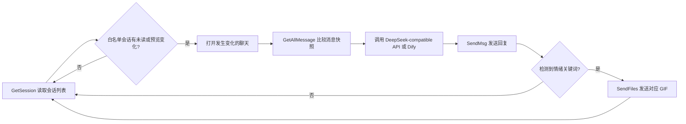

# Dream-Moments-Dify

基于 **My-Dream-Moments / KouriChat** 的 Windows 微信 4 私人聊天机器人实验项目。

[](LICENSE)

> 本项目保留原项目署名和 GPLv3 许可证。它不破解 `wxautox4` Plus，也不包含付费包授权绕过代码；微信自动化使用免费版 `wxauto4` 的公开接口。

## 本分支改动

- **免费微信 4 适配**：使用 `wxauto4==41.1.2`，兼容微信 `4.1.11.x` 的昵称读取。
- **智能未读轮询**：启动时仅为白名单会话建立一次消息基线；之后通过 `GetSession()` 检查未读数和会话预览，只在收到新消息时打开对应聊天，不再持续来回刷新窗口。
- **双 AI 后端**：默认支持 DeepSeek、SiliconFlow 等 OpenAI-compatible Chat Completions API，也可切换到 Dify Chat API。
- **群聊回复不自动 @**：群聊可通过 `@机器人昵称`、单独提及机器人昵称，或引用机器人的上一条消息触发；机器人回复不会再次 `@触发者`。
- **外部群聊插件**：自动加载 `plugins/*/dream_plugin.py`；插件可观察白名单群消息并直接处理命令，异常不会中断主机器人。
- **情绪 GIF 表情**：根据 AI 回复中的开心、难过、生气等关键词，发送对应的可爱动画猫咪表情。
- **更简洁的输出与配置**：启动时只打印一份简洁版权横幅；控制台显示状态和警告，详细 INFO 日志写入 `logs/`；WebUI 仅展示常用微信轮询参数。

## 项目沿革与原有能力

本项目早期版本在上游基础上加入了 Dify 平台对接、群聊唤醒优化和角色化对话支持。本次更新没有删除这些核心能力，而是在原有功能上继续维护：

- 微信好友和群聊中的文字对话；
- 多轮上下文和自定义角色设定；
- Dify 应用、Prompt 与模型参数管理；
- `@机器人昵称`、机器人昵称开头和引用机器人消息三种群聊触发方式；
- 外部插件目录扫描、隔离调用和直接回复；
- 消息分段、队列处理以及图片、表情等原有处理模块；
- 新增免费微信 4 智能轮询、DeepSeek 直连和情绪 GIF。

## 工作方式



免费版仍属于**前台 UI 自动化**：启动首次建立基线时会逐个打开白名单会话；收到新消息、发送文字或发送文件时也可能切换到目标聊天。没有新消息时不会持续切换窗口。

## 使用示例

以下是项目早期版本的实际界面示例。截图中的个人标识已经永久遮盖；当前版本的界面可能略有变化，并且群聊回复已不会自动 `@触发者`。

个人私聊触发：


群聊 `@机器人昵称` 触发：


群聊使用机器人昵称开头触发：


## 环境要求

- Windows 10/11
- 已登录的微信 4 客户端
- Python `>=3.9,<3.14`
- 建议先用测试账号、一个好友或一个群验证

`wxauto4==41.1.2` 不支持 Python 3.8。安装依赖和运行项目必须使用同一个 Python 解释器：

```powershell
python --version
python -m pip --version
python -m pip install -r requirements.txt
```

## 安装与配置

```powershell
git clone https://github.com/<owner>/Dream-Moments-Dify.git
cd Dream-Moments-Dify
python -m pip install -r requirements.txt
Copy-Item src\config\config.json.template src\config\config.json
python run_config_web.py
```

也可以直接编辑本地文件 `src/config/config.json`。该文件已加入 `.gitignore`，不要提交真实 API Key、微信昵称、联系人列表或私人角色设定。

### 必填配置

1. `LISTEN_LIST`：需要监听的微信昵称或群名。
2. `AI_PROVIDER`：
   - `deepseek`：直接调用 OpenAI-compatible API；
   - `dify`：调用 Dify Chat API。
3. 直连模式：填写 `DEEPSEEK_API_KEY`、`DEEPSEEK_BASE_URL`、`MODEL`。
4. Dify 模式：填写 `DIFY_API_KEY`、`DIFY_BASE_URL`。
5. `WECHAT_POLL_INTERVAL`：检查新消息的间隔，默认 `2.0` 秒。

直连示例：

```text
AI_PROVIDER=deepseek
DEEPSEEK_API_KEY=<your-api-key>
DEEPSEEK_BASE_URL=https://api.deepseek.com/v1/
MODEL=deepseek-chat
MAX_TOKEN=2000
TEMPERATURE=1.0
```

SiliconFlow 等兼容服务也可以使用，但模型名、Base URL 和 API Key 必须来自同一个服务商。若 Dify 返回 `PluginInvokeError`、供应商 `401` 或 `Authentication Fails`，通常是 Dify 应用内部配置的模型凭据失效，并非微信监听故障。

## 运行

```powershell
python run.py
```

群聊触发规则：

- `@机器人昵称 你好`
- `机器人昵称 你好`
- 在微信中引用机器人的上一条消息，再输入回复内容

机器人会直接回复内容，不自动 `@触发者`。引用其他群成员的消息不会触发机器人。

## 外部群聊插件

Dream 会在启动时扫描项目根目录下的 `plugins/*/dream_plugin.py`。安装 GroupFun 群聊娱乐插件：

```powershell
New-Item -ItemType Directory -Force plugins | Out-Null
git clone https://github.com/yishuizhe/dow-group-fun.git plugins/GroupFun
Copy-Item plugins\GroupFun\config.json.template plugins\GroupFun\config.json
python run.py
```

可直接在群聊中发送：

- `今日水王` / `本周水王` / `本月水王`
- `梗百科` / `梗排行榜`
- `我的成就`
- `娱乐帮助`

这些插件命令不需要 `@机器人`。为了统计排行和梗，插件会观察 `LISTEN_LIST` 白名单中的普通群文本，并默认保存到本机 `plugins/GroupFun/data/fun_center.db`。插件没有返回命令结果时，Dream 才继续执行原有 AI 触发规则。插件回复不会自动 `@触发者`。

插件目录、私人配置和运行数据库不会提交到 Dream 主仓库；详细配置、数据说明和 MIT 许可证见 GroupFun 插件仓库。

## 情绪 GIF 表情

默认目录：

```text
data/avatars/MONO/emojis/
├─ happy/
├─ sad/
├─ angry/
└─ neutral/
```

情绪关键词在 `src/handlers/emoji.py` 的 `emotion_map` 中配置。可以把自己的 `.gif`、`.png`、`.jpg` 或 `.jpeg` 文件放入对应目录；不要提交来源和许可不明确的表情包。

仓库内置的 6 个动画猫咪 GIF 来自 Google **Noto Emoji Animation**，使用 CC BY 4.0 许可。详细署名见 `data/avatars/MONO/emojis/ATTRIBUTION.md`。

## 隐私与安全

公开仓库只提供空白配置和通用 `avatar.md` 示例。以下内容不应提交：

- `src/config/config.json`
- API Key、Token、Cookie、GitHub 凭据
- 微信昵称、群名、联系人列表、微信号
- 私人角色关系、真实姓名或聊天记录
- `logs/`、`data/wechat_poll_state.json`、`plugins/*/config.json`、插件数据库、含私人信息的截图和运行时缓存

如果曾经把密钥提交到 Git 历史中，仅删除文件并不足够；应立即撤销旧密钥，并按需要清理 Git 历史。

## 测试

```powershell
python -m unittest discover -s tests -v
python test.py
python -m compileall -q src tests run.py run_config_web.py test.py
```

测试覆盖微信消息去重、未读驱动轮询、引用回复触发、外部插件隔离、群聊回复不自动 @、AI 后端切换、配置保存和微信兼容层。

## 已知限制

- 免费版依赖微信前台 UI，微信不能处于完全不可操作状态。
- 新消息到达、回复或发送文件时仍可能切换当前聊天并短暂影响焦点。
- 会话预览完全不变化且微信不提供未读标记的极端情况下，可能延迟发现消息。
- 微信升级后如果 UI Automation 控件结构变化，可能需要调整兼容层。
- 请控制监听对象数量和发送频率，不要用于批量营销、骚扰或规避平台规则。

## 声明与免责声明

- 本项目仅供个人学习、技术研究和自用，不得用于批量营销、骚扰、违法活动或规避平台规则。
- LLM 生成内容不代表项目作者、维护者或上游作者的观点；使用者应自行判断并承担使用结果。
- 自定义角色、Prompt、图片和聊天内容的相关权利归各自权利人所有，请勿未经许可传播私人内容或受保护材料。
- 本项目按现状提供，不对微信版本兼容性、模型输出准确性、服务稳定性或使用造成的直接、间接损失作任何保证。
- 使用者应遵守所在地法律法规、微信使用规则和第三方 API 服务条款，并妥善保护 API Key、联系人信息和聊天记录。

## 原项目与许可证

本项目基于以下 GPLv3 项目继续维护：

- [KouriChat/KouriChat](https://github.com/KouriChat/KouriChat)
- [umaru-233/My-Dream-Moments](https://github.com/umaru-233/My-Dream-Moments)

原作者和贡献者的版权归其各自所有。本仓库继续按 [GNU General Public License v3.0](LICENSE) 分发，不提供任何担保。第三方素材可能使用不同许可证，详见对应目录中的署名文件。
