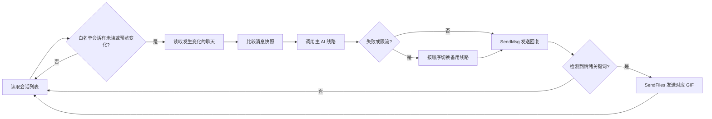
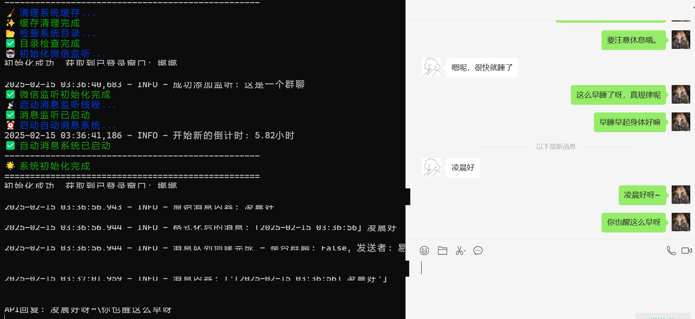
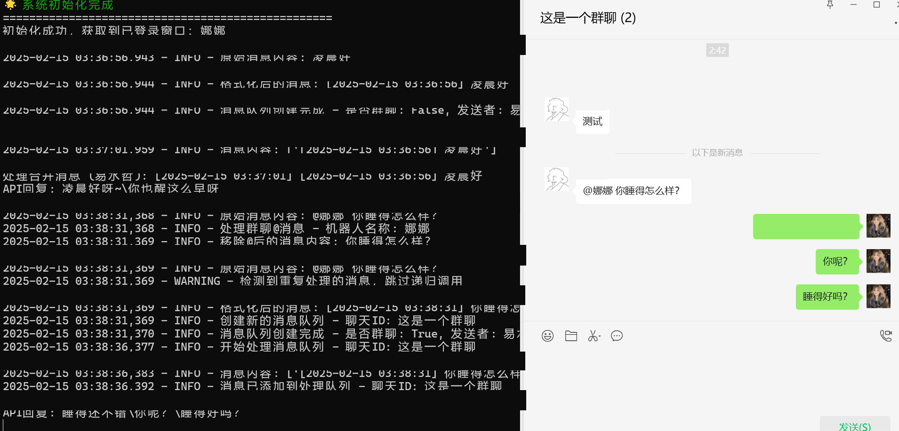
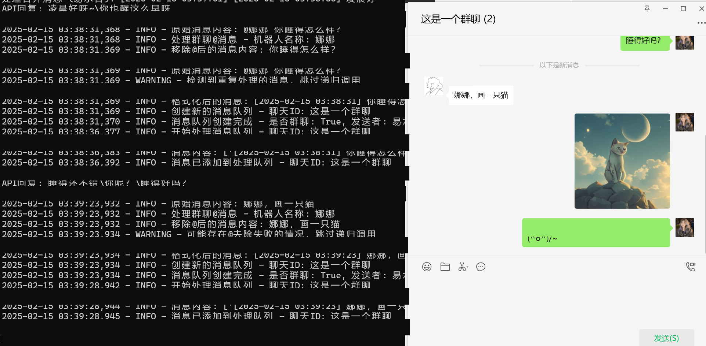

# Dream-Moments-Dify

[](https://github.com/yishuizhe/Dream-Moments-Dify/actions/workflows/ci.yml)
[](https://github.com/yishuizhe/Dream-Moments-Dify/releases/latest)
[](https://github.com/yishuizhe/Dream-Moments-Dify/releases)

基于 **My-Dream-Moments / KouriChat** 的 Windows 微信 4 私人聊天机器人实验项目。

[](LICENSE)

> 本项目保留原项目署名和 GPLv3 许可证。它不破解 `wxautox4` Plus，也不包含付费包授权绕过代码；微信自动化使用开源的 `wxauto4` 与 `wechatauto-replica`。

## 本分支改动

- **免费微信 4 适配**：微信 `4.1.11.x` 使用 `wxauto4==41.1.2`；微信 `4.1.12+` 自动切换到 `wechatauto-replica==1.1.9`，绕过新版只暴露空 UIA 外壳的问题。
- **智能未读轮询**：启动时仅为白名单会话建立一次消息基线；之后通过 `GetSession()` 检查未读数和会话预览，只在收到新消息时打开对应聊天，不再持续来回刷新窗口。
- **群聊改名不断档**：监听、聊天历史、成员记忆和支持迁移的插件统计使用稳定的微信会话 ID；群名变化后自动更新显示名并沿用原有数据，不会另起一个新会话。
- **升级快照保护**：从旧轮询器切换到微信数据库消息 ID 时自动重建一次基线；新版数据库后端直接轮询白名单消息表，并结合群成员 wxid 前缀校正收发方向，避免会话预览滞后或方向误判导致漏收。
- **多 AI 线路**：主线路加 3 条 OpenAI-compatible 备用线路，支持限流/超时自动切换、60 秒熔断和上下文同步；也可切换到 Dify Chat API。
- **回复格式保护**：普通私聊默认 1–2 个短句，群聊更短；遇到明显无标点长句时会保守补齐标点，并按句子和长度自动拆分微信气泡，不再依赖模型输出 `\`。
- **群聊回复不自动 @**：群聊可通过 `@机器人昵称`、单独提及机器人昵称，或引用机器人的上一条消息触发；机器人回复不会再次 `@触发者`。
- **群成员身份识别**：进入 AI 上下文的群消息会保留时间、成员昵称和成员 ID；不同成员不再被当成同一个人。
- **按成员本地记忆**：私聊用户和每个群成员使用独立身份键，在本机 SQLite 中保存有限的近期记忆，可随时查看或清除。
- **内置聊天总结**：`ChatSummary` 插件支持总结群聊最近 50/100 条记录，也能只总结指定成员。
- **独立图片 API**：文本模型和图片模型分开配置；不会再把 DeepSeek 文本地址误当成 `/images/generations` 图片接口。
- **外部群聊插件**：自动加载 `plugins/*/dream_plugin.py`；插件可观察白名单群消息并直接处理命令，异常不会中断主机器人。
- **情绪 GIF 表情**：根据 AI 回复中的开心、难过、生气等关键词，发送对应的可爱动画猫咪表情。
- **单页控制台**：启动时只打印一份简洁版权横幅；`http://127.0.0.1:8501/console` 集中管理机器人状态、AI/微信配置、识图、早报、人性化参数和角色人设，详细 INFO 日志写入 `logs/`。

## 项目沿革与原有能力

本项目早期版本在上游基础上加入了 Dify 平台对接、群聊唤醒优化和角色化对话支持。本次更新没有删除这些核心能力，而是在原有功能上继续维护：

- 微信好友和群聊中的文字对话；
- 多轮上下文和自定义角色设定；
- Dify 应用、Prompt 与模型参数管理；
- `@机器人昵称`、机器人昵称开头和引用机器人消息三种群聊触发方式；
- 外部插件目录扫描、隔离调用和直接回复；
- 消息分段、队列处理以及图片、表情等原有处理模块；
- 新增免费微信 4 智能轮询、DeepSeek 直连和情绪 GIF。

## 工作方式


```mermaid
flowchart LR
    A[读取会话列表] --> B{白名单会话有未读或预览变化?}
    B -- 否 --> A
    B -- 是 --> C[读取发生变化的聊天]
    C --> D[比较消息快照]
    D --> E[调用主 AI 线路]
    E --> I{失败或限流?}
    I -- 是 --> J[按顺序切换备用线路]
    I -- 否 --> F[SendMsg 发送回复]
    J --> F
    F --> G{检测到情绪关键词?}
    G -- 是 --> H[SendFiles 发送对应 GIF]
    G -- 否 --> A
    H --> A
```

微信 `4.1.12+` 的消息接收从本机微信数据库读取，不再反复切换窗口；发送文字、图片或文件时仍会短暂操作微信前台界面，因此桌面需要保持解锁。微信 `4.1.11.x` 继续使用原有的前台 UI 自动化轮询。

## 使用示例

以下是项目早期版本的实际界面示例。截图中的个人标识已经永久遮盖；当前版本的界面可能略有变化，并且群聊回复已不会自动 `@触发者`。

个人私聊触发：



群聊 `@机器人昵称` 触发：



群聊使用机器人昵称开头触发：



## 环境要求

- Windows 10/11
- 已登录的微信 4 客户端
- Python `>=3.10,<3.14`
- 建议先用测试账号、一个好友或一个群验证

`wxauto4==41.1.2` 不支持 Python 3.8；新版兼容后端也需要 Python 3.9+。安装依赖和运行项目必须使用同一个 Python 解释器：

```powershell
python --version
python -m pip --version
python -m pip install -r requirements.txt
```

## 安装与配置

```powershell
git clone https://github.com/<owner>/Dream-Moments-Dify.git
cd Dream-Moments-Dify
python -m pip install -r requirements.txt
Copy-Item src\config\config.json.template src\config\config.json
python run_config_web.py
```

启动后只使用 `/console` 这一处控制台；旧版 dashboard、配置页和快速设置页已移除。

也可以直接编辑本地文件 `src/config/config.json`。该文件已加入 `.gitignore`，不要提交真实 API Key、微信昵称、联系人列表或私人角色设定。

### 必填配置

1. `LISTEN_LIST`：需要监听的微信昵称或群名。
2. `AI_PROVIDER`：
   - `openai_compatible`：直接调用任意 OpenAI-compatible API（推荐）；
   - `deepseek`：旧配置的兼容别名，行为与 `openai_compatible` 相同；
   - `dify`：调用 Dify Chat API。
3. 直连模式：填写 `DEEPSEEK_API_KEY`、`DEEPSEEK_BASE_URL`、`MODEL`。
4. Dify 模式：填写 `DIFY_API_KEY`、`DIFY_BASE_URL`。
5. `WECHAT_POLL_INTERVAL`：检查新消息的间隔，默认 `2.0` 秒。

直连示例：

```text
AI_PROVIDER=openai_compatible
DEEPSEEK_API_KEY=<your-api-key>
DEEPSEEK_BASE_URL=https://api.deepseek.com/v1/
MODEL=deepseek-chat
MAX_TOKEN=2000
TEMPERATURE=1.0
```

SiliconFlow 等兼容服务也可以使用，但模型名、Base URL 和 API Key 必须来自同一个服务商。若 Dify 返回 `PluginInvokeError`、供应商 `401` 或 `Authentication Fails`，通常是 Dify 应用内部配置的模型凭据失效，并非微信监听故障。

### 免费线路和自动切换

在 `http://127.0.0.1:8501/console`的「AI 配置」中填主线路，再在「AI 备用线路」中最多配置 3 条。每条线路都需要同一家的 Base URL、API Key 和模型 ID。主线路超时、限流或返回异常时会按配置顺序自动切换；失败线路会暂停 60 秒，避免每条消息都重复等待。

| 服务商 | Base URL | 模型填法 | 注意 |
| --- | --- | --- | --- |
| 智谱 | `https://open.bigmodel.cn/api/paas/v4/` | `glm-4.7-flash` | 可作国内免费主线 |
| ModelScope | `https://api-inference.modelscope.cn/v1` | 从当前 API-Inference 可用列表复制 | 额度和常驻模型会变化 |
| SiliconFlow | `https://api.siliconflow.cn/v1` | 从控制台选当前免费标识模型 | 不应假设某模型永久免费 |
| Gemini | `https://generativelanguage.googleapis.com/v1beta/openai/` | 从 AI Studio 选当前免费层 Flash 模型 | 中国大陆/香港不在官方支持地区 |
| Groq | `https://api.groq.com/openai/v1` | 如 `qwen/qwen3.6-27b` | 免费额度按模型计算 |
| OpenRouter | `https://openrouter.ai/api/v1` | `openrouter/free` | 免费路由不适合作唯一生产线路 |
| Cloudflare | `https://api.cloudflare.com/client/v4/accounts/<ACCOUNT_ID>/ai/v1` | 从 Workers AI 模型库选择 | URL 必须包含自己的 Account ID |

建议顺序：智谱免费模型作主线，ModelScope/Groq 作备用，DeepSeek 放在最后并开启「仅复杂任务」。这个选项表示普通闲聊绝不调用该付费线路；复杂请求也只在前面线路失败后才会兜底。

### 图片生成配置

DeepSeek 的 Chat Completions 文本 API 不提供 `/images/generations`。需要画图时，请在 WebUI 的“图像生成配置”中单独填写：

- `IMAGE_ENABLED=true`
- `IMAGE_API_KEY`
- `IMAGE_BASE_URL`
- `IMAGE_MODEL`
- `TEMP_IMAGE_DIR`（可选）

这些参数必须来自真正支持 OpenAI-compatible `/images/generations` 的图像服务。未启用或配置不完整时，Dream 会直接返回配置提示，不会再向 `api.deepseek.com` 发起图片请求。图像接口可返回 URL 或 `b64_json`。

## 运行

```powershell
python run.py
```

群聊触发规则：

- `@机器人昵称 你好`
- `机器人昵称 你好`
- 在微信中引用机器人的上一条消息，再输入回复内容

机器人会直接回复内容，不自动 `@触发者`。引用其他群成员的消息不会触发机器人。群消息进入 AI 上下文时会保留发送者标签，当前触发者也会单独标明，因此不同群成员不会再共用同一个身份。

### 本地记忆

Dream 会把有限数量的近期用户消息保存在本机 `data/database/chat_history.db`：

- 私聊按用户隔离；
- 群聊按“群 + 成员”隔离；
- 每个身份默认最多保留 12 条候选记忆，回复时最多注入最近 8 条；
- API Key、密码、总结命令和记忆管理命令会被过滤；
- 发送 `查看我的记忆` 可查看当前身份的本地记忆；
- 发送 `清除我的记忆` 可删除当前身份的本地记忆。

群聊中的记忆命令仍遵循正常 AI 触发规则，需要 `@机器人`、提及机器人昵称或引用机器人的消息。SQLite 文件已被 Git 忽略，不会进入仓库或 Release；它仍是本机明文数据，请保护电脑账户和项目目录。

### 群聊总结

内置 `plugins/ChatSummary` 无需额外安装，可在白名单群直接发送：

- `总结最近50条`
- `总结群聊100条`
- `总结 @张三 最近50条`
- `总结 张三 最近100条`

总结命令只允许 50 或 100 条；指定成员时按群内显示昵称精确匹配。总结使用独立 AI 上下文，不会污染日常对话上下文，也不会自动 `@触发者`。

## 通过微信控制安卓手机（Operit）

Dream 可以把明确前缀或“用你的手机打开……”“你手机还有多少电”等自然表达转发给安卓手机上的
[Operit](https://github.com/AAswordman/Operit)，再由角色模型提炼关键结果发回原微信会话。

先在 Operit 中打开“设置 → 数据和权限 → 外部 HTTP 调用”，记录手机局域网地址和
Bearer Token。然后在 Dream 配置页的“Operit 安卓手机控制”中设置：

- `enabled`：启用桥接；
- `base_url`：例如 `http://192.168.1.23:8094`；
- `bearer_token`：Operit 页面展示的 Token；
- `allowed_senders`：允许控制手机的微信发送者 ID 或昵称，不能为空；
- `allowed_chats`：可选的会话白名单；
- `allow_group_commands`：默认关闭，建议只在私聊中使用。

可用命令：

- `手机：打开设置`：执行普通手机任务；
- `/手机状态`：检查 Operit 是否在线；
- `/手机新会话`：清除当前微信会话对应的 Operit 上下文；
- `手机确认 123456`：确认付款、发送、删除、安装等高风险指令；
- `手机取消`：取消尚未确认的高风险指令。

自然查询覆盖电量、电池、品牌、型号、系统版本、通知、网络、存储、内存、温度、
位置、音量、亮度和屏幕状态等。设备状态会被改写为必须实际读取的任务；没有真实结果时
角色会明确说没查到，不会猜测，也不会先发送固定的“我拿手机看看”。失败或缺少数据的
任务不会写入长期记忆。非授权者的自然请求只会得到简短的角色化拒绝，不会暴露接口名称。

任务在后台线程中执行，不会阻塞微信轮询。Dream 会把每个微信会话对应的 Operit
`chat_id` 保存在 `data/operit_sessions.json`，该文件已被 Git 忽略。HTTP 请求不会自动
重试，避免发送消息、付款或删除操作被重复执行。

不要把 Operit 的 `8094` 端口直接暴露到公网；异地连接应使用 Tailscale、WireGuard
等可信私网。Bearer Token 不应提交到 GitHub。即使启用了群聊命令，也必须同时配置
发送者白名单，危险操作仍会要求一次性确认码。

## 自研娜娜手机端（推荐）

仓库同时提供不依赖 Operit 的安卓执行端，源码位于 `android/NanaPhone`。它直接从安卓系统读取
电量、型号、网络和存储，并通过无障碍服务执行打开应用、返回、点击、输入和滑动；请求使用
时间戳、随机 nonce 与 HMAC-SHA256 签名，失败结果不会被模型补全。

从 [GitHub Releases](https://github.com/yishuizhe/Dream-Moments-Dify/releases) 下载并安装 `NanaPhone-debug.apk` 后，在 App 中启动服务、复制配对密钥，再到配置页的
“娜娜自研手机端”填写手机地址与密钥并启用。启用后手机任务优先走自研端，不再交给 Operit；
微信发送者白名单、会话白名单、群聊开关和危险操作确认继续沿用原手机控制安全设置。
完整步骤见 `android/NanaPhone/README.md`。

## AI 回复格式

程序会在角色提示词末尾追加格式约束，并在发送前进行二次保护：

- 私聊日常回复默认 1–2 个短句，尽量不超过 60 个中文字；群聊默认 1 个短句、最多 2 句；
- 正常使用句号、问号、感叹号和逗号；
- 按换行、句子边界和长度自动拆分微信气泡；
- 兼容旧角色提示词返回的反斜杠分隔，但新角色提示词不应再要求“禁止标点”或“使用反斜杠分段”。

## 外部群聊插件

Dream 会在启动时扫描项目根目录下的 `plugins/*/dream_plugin.py`。安装 GroupFun 群聊娱乐插件：

```powershell
New-Item -ItemType Directory -Force plugins | Out-Null
git clone https://github.com/yishuizhe/dow-group-fun.git plugins/GroupFun
Copy-Item plugins\GroupFun\config.json.template plugins\GroupFun\config.json
python run.py
```

可直接在群聊中发送：

- `今日水王` / `本周水王` / `本月水王`
- `梗百科` / `梗排行榜`
- `我的成就`
- `娱乐帮助`

这些插件命令不需要 `@机器人`。为了统计排行和梗，插件会观察 `LISTEN_LIST` 白名单中的普通群文本，并默认保存到本机 `plugins/GroupFun/data/fun_center.db`。插件没有返回命令结果时，Dream 才继续执行原有 AI 触发规则。插件回复不会自动 `@触发者`。

插件目录、私人配置和运行数据库不会提交到 Dream 主仓库；详细配置、数据说明和 MIT 许可证见 GroupFun 插件仓库。

## 情绪 GIF 表情

默认目录：

```text
data/avatars/MONO/emojis/
├─ happy/
├─ sad/
├─ angry/
└─ neutral/
```

情绪关键词在 `src/handlers/emoji.py` 的 `emotion_map` 中配置。可以把自己的 `.gif`、`.png`、`.jpg` 或 `.jpeg` 文件放入对应目录；不要提交来源和许可不明确的表情包。

仓库内置的 6 个动画猫咪 GIF 来自 Google **Noto Emoji Animation**，使用 CC BY 4.0 许可。详细署名见 `data/avatars/MONO/emojis/ATTRIBUTION.md`。

## 隐私与安全

微信 `4.1.12+` 的 UIA 消息控件已不可用，兼容后端会在本机读取并解密当前登录账号的微信数据库，且可能从微信进程中提取本地数据库密钥；数据不会由该兼容层上传。请仅在自己的电脑和账号上使用，并优先用测试账号验证。项目仍会把需要回复的内容发送给你配置的 AI 服务商。

公开仓库只提供空白配置和通用 `avatar.md` 示例。以下内容不应提交：

- `src/config/config.json`
- API Key、Token、Cookie、GitHub 凭据
- 微信昵称、群名、联系人列表、微信号
- 私人角色关系、真实姓名或聊天记录
- `logs/`、`data/wechat_poll_state.json`、`data/database/chat_history.db`、`plugins/*/config.json`、插件数据库、含私人信息的截图和运行时缓存

如果曾经把密钥提交到 Git 历史中，仅删除文件并不足够；应立即撤销旧密钥，并按需要清理 Git 历史。

## 测试

```powershell
python -m unittest discover -s tests -v
python test.py
python -m compileall -q src tests plugins/ChatSummary run.py run_config_web.py test.py
```

测试覆盖微信消息去重、未读驱动轮询、引用回复触发、群成员身份隔离、本地记忆、50/100 条总结、独立图片 API、外部插件隔离、群聊回复不自动 @、AI 后端切换、回复标点修复与气泡拆分、配置保存和微信兼容层。

## 已知限制

- 微信 `4.1.12+` 接收消息不依赖前台 UI，但发送消息仍要求桌面保持解锁、微信处于可操作状态。
- 回复或发送文件时可能切换当前聊天并短暂影响焦点。
- 会话预览完全不变化且微信不提供未读标记的极端情况下，可能延迟发现消息。
- 微信升级后如果 UI Automation 控件结构变化，可能需要调整兼容层。
- 请控制监听对象数量和发送频率，不要用于批量营销、骚扰或规避平台规则。

## 声明与免责声明

- 本项目仅供个人学习、技术研究和自用，不得用于批量营销、骚扰、违法活动或规避平台规则。
- LLM 生成内容不代表项目作者、维护者或上游作者的观点；使用者应自行判断并承担使用结果。
- 自定义角色、Prompt、图片和聊天内容的相关权利归各自权利人所有，请勿未经许可传播私人内容或受保护材料。
- 本项目按现状提供，不对微信版本兼容性、模型输出准确性、服务稳定性或使用造成的直接、间接损失作任何保证。
- 使用者应遵守所在地法律法规、微信使用规则和第三方 API 服务条款，并妥善保护 API Key、联系人信息和聊天记录。

## 原项目与许可证

本项目基于以下 GPLv3 项目继续维护：

- [KouriChat/KouriChat](https://github.com/KouriChat/KouriChat)
- [umaru-233/My-Dream-Moments](https://github.com/umaru-233/My-Dream-Moments)

原作者和贡献者的版权归其各自所有。本仓库继续按 [GNU General Public License v3.0](LICENSE) 分发，不提供任何担保。第三方素材可能使用不同许可证，详见对应目录中的署名文件。
