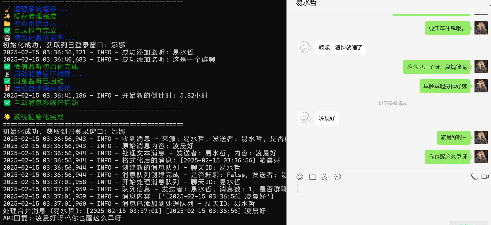
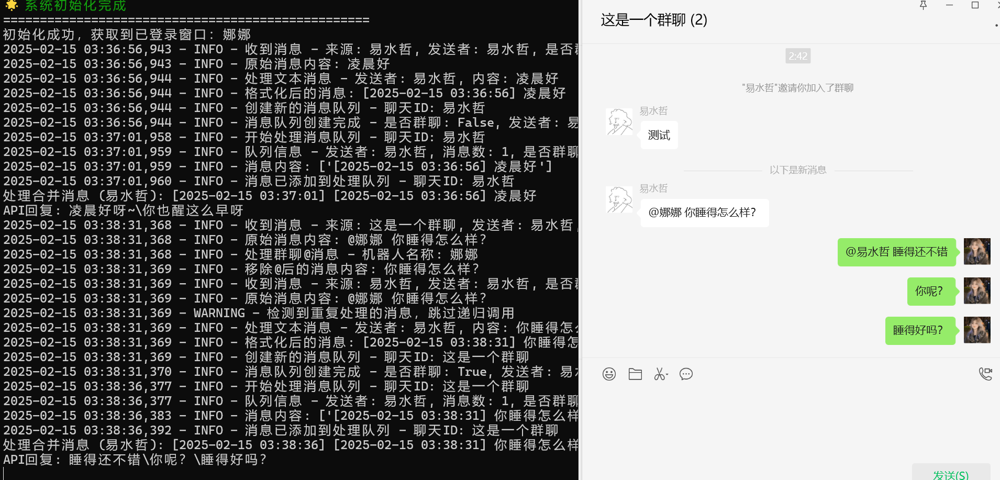
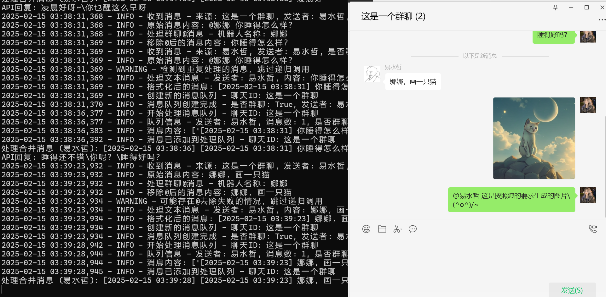

- # Dream-Moments-Dify
  
  [简体中文](./README.md) · English
  
  My-Dream-Moments (Enhanced with Dify Integration)
  
  [](https://www.gnu.org/licenses/gpl-3.0)
  
  🚀 **My-Dream-Moments** is an emotional companionship program based on LLM (Large Language Model), supporting WeChat for a more realistic emotional interaction experience.
  
  This project is a modified version of [umaru-233/My-Dream-Moments](https://github.com/umaru-233/My-Dream-Moments), with the following improvements:
  
  ## ⚡ Enhancements
  
  - **Dify Platform Integration**: Supports Dify as the backend for AI responses, making them more intelligent and controllable. Dify platform: https://cloud.dify.ai/
  - **Bot Activation Optimization**: Fixed an issue where the bot could not be triggered on WeChat desktop when mentioned, and added a feature to trigger the bot by starting a message with its name.
  - **Image Generation Support**: Retains the image generation feature using deepseek-ai/Janus-Pro-7B, requiring API configuration.
  
  ## 🎨 Future Plans
  
  - Switch between Dify platform and Silicon Flow platform.
  - Support manual disabling of proactive messaging.
  - Keep up with the author's updates and new features.
  
  ## ✨ Features
  
  - **WeChat Bot Integration**: Enables natural interaction with WeChat friends and group chats.
  - **Multi-turn Conversation Support**: Provides intelligent conversation management for seamless interactions.
  - **Dify Platform Support**: Allows switching to Dify as the AI engine with customizable prompts and model configurations.
  - **Role-playing Mode**: Offers immersive conversations with personalized settings.
  - **Sticker & Image Generation**: Supports AI-generated images and sending stickers.
  
  ## 📦 Known Issues
  
  - Rare cases of recursive loops in message processing.
  - The model's responses may lean towards Dify platform prompts.
  - Model temperature and other parameters can be configured on the Dify platform.
  - Rare cases of incomplete responses, possibly related to max token settings.
  
  ## Usage Example:
  
  Personal Chat Trigger:
  
  
  
  Group Chat @ Trigger:
  
  
  
  Group Chat Prefix Trigger:
  
  
  
  ## 📌 Installation & Usage
  
  ### 1. Prerequisites
  
  1. **Spare Phone / Android Emulator**
  
     Since WeChat desktop login requires a mobile device to be logged in simultaneously, avoid using your primary device.
  
  2. **WeChat Secondary Account**
  
     A separate WeChat account is required for login on the desktop version.
  
  3. **DeepSeek API Key**
  
     Recommended: [Get API Key (15 RMB Free Credit)](https://cloud.siliconflow.cn/i/aQXU6eC5)
  
  4. **Dify API Key**
  
     https://cloud.dify.ai/
  
  5. **Modify Dify Application Prompts**
  
     Regardless of the model, include the following instructions or similar meanings:
  
     ```
     Note: Each dialogue should be separated by \ with a maximum of two \ per response.
     Or
     Use backslashes \ to separate sentences or phrases, refer to the output examples. The model output should not include timestamps.
     Example Output:
     This movie is great, do you like it?\ The core of this question is algorithm optimization, which can be analyzed from the perspectives of time complexity and space complexity...\ Are you secretly learning my hobbies?\ Hmm? Are you trying to test my logic?\ Hmm\ I also need to eat\ Tiramisu is quite delicious\ But delicious food means happiness!\ This problem needs to be solved in three steps~\ You are looking at something strange\ You are saying something unusual
     ```
  
  ### 2. Deploy the Project
  
  #### 1️⃣ Clone the Repository
  
  ```bash
  git clone https://github.com/yishuizhe/Dream-Moments-Dify.git
  cd My-Dream-Moments-Dify
  ```
  One click start
  
  The original project now supports one click deployment:
  
  Run the program. bat and I will start it
  
  Manually as follows:
  
  #### 2️⃣ Install Dependencies
  
  ```bash
  pip install -r requirements.txt
  ```
  
  #### 3️⃣ Configure Settings
  
  Modify `\src\config\settings.py` to set up your Dify and DeepSeek API keys.
  
  #### 4️⃣ Run the Project
  
  ```bash
  python run.py
  ```
  
  For issues related to the original project, join the group: **715616260**
  
  - Deployment is recommended on a Windows server. [Rainyun Discount - Get a 50% Off Coupon for the First Month](https://www.rainyun.com/MzE0MTU=_)
  - Get DeepSeek API Key: [15 RMB Free Credit](https://cloud.siliconflow.cn/i/aQXU6eC5)
  
  ------
  
  ### 3. How to Use
  
  - **Log in to WeChat Desktop with a Secondary Account**
  
  - **Run the project and check the console output:**
  
    ```bash
    Initialization successful, logged in as: <Your WeChat Nickname>
    BOT is now running...
    ```
  
    The bot will now listen and automatically reply to messages using the AI model.
  
  ## Disclaimer
  
  - This project is for educational and research purposes only. The statements generated by the LLM do not represent the author's personal views. The prompts used to simulate roles belong to their original authors. Any restricted actions conducted without permission are the sole responsibility of the user.
  
  ## 📜 License
  
  This project is licensed under **GPL v3**. Please comply with the open-source agreement. **Original Project:** [umaru-233/My-Dream-Moments](https://github.com/umaru-233/My-Dream-Moments) If this project helps you, feel free to Star ⭐ and support it!
  
  ## 🙌 Acknowledgments
  
  Thanks to [umaru-233](https://github.com/umaru-233) for providing the original project. This project enhances and optimizes the original functionality. If you have any questions or suggestions, feel free to submit an Issue or Pull Request!
  
  ## **Disclaimer [Must Read]**
  
  - This project is intended for learning and technical research purposes only and must not be used for any commercial or illegal activities. The user is solely responsible for any consequences.
  - The project author does not guarantee the security, completeness, reliability, effectiveness, correctness, or applicability of this tool, nor is the author responsible for any direct or indirect losses, liabilities, claims, demands, or lawsuits caused by the use or misuse of this tool.
  - The project author reserves the right to modify, update, delete, or terminate this tool at any time without prior notice or any obligations.
  - Users must comply with relevant laws and regulations, respect WeChat's copyright and privacy rights, and must not infringe upon the legal rights of WeChat or other third parties.
  - Users acknowledge that by downloading, installing, running, or using this tool, they have read and agreed to this disclaimer. If you disagree, please stop using this tool and delete all related files immediately.
  - The WeChat integration methods provided in this project are sourced from other open-source projects and are only for learning and technical research purposes.
