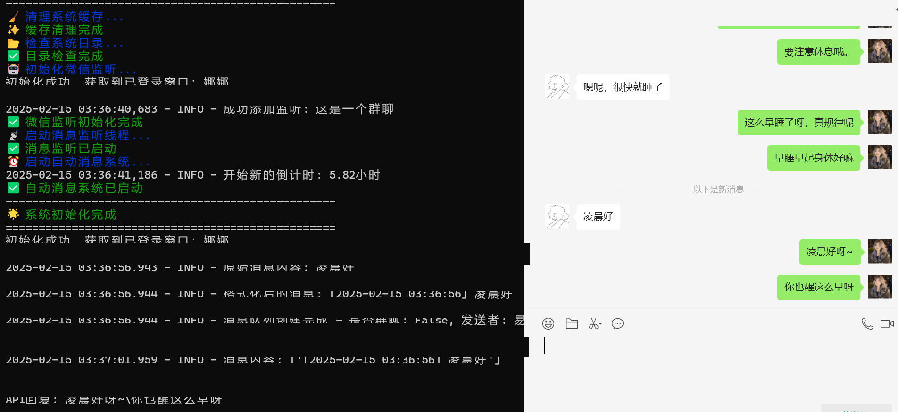
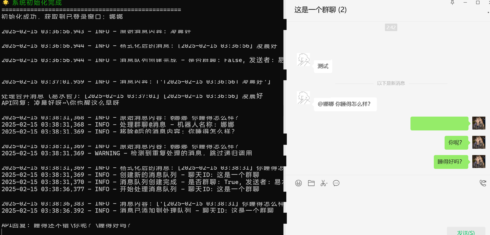
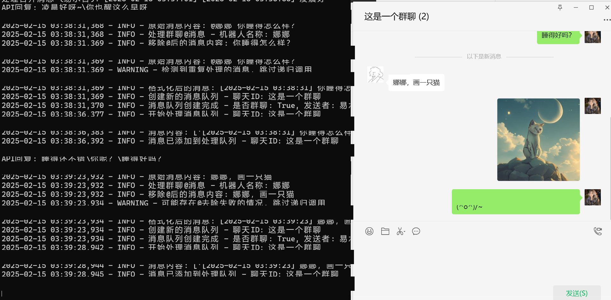

# Dream-Moments-Dify

An experimental Windows WeChat 4 private chat bot derived from **My-Dream-Moments / KouriChat**.

[](LICENSE)

This project preserves the original attribution and GPLv3 license. It does not bypass `wxautox4` Plus licensing; WeChat automation uses the public APIs of the free `wxauto4` package.

## Highlights

- Free `wxauto4==41.1.2` adapter with WeChat `4.1.11.x` nickname compatibility.
- `GetSession()`-driven polling: chats are opened once to build a baseline, then only unread or preview-changed whitelisted chats are opened.
- Direct DeepSeek/OpenAI-compatible Chat Completions or Dify Chat API.
- Group messages can also trigger the bot by quoting a previous bot message, and replies no longer automatically mention the triggering member.
- External `plugins/*/dream_plugin.py` support with isolated failures and direct command replies.
- Emotion-aware animated cat GIFs from Google Noto Emoji Animation.
- One concise startup banner, WARNING+ console logs, and detailed INFO file logs.

## Project history and retained capabilities

Earlier versions added Dify integration, improved group-chat wake-up handling, and role-based conversations on top of the upstream projects. This update retains those capabilities while adding the free WeChat 4 polling adapter, direct DeepSeek-compatible access, and emotion GIFs. Existing modules for multi-turn context, prompts, message splitting/queues, images, and emoji handling remain available.

## Usage examples

These are interface examples from an earlier version. Personal identifiers have been permanently redacted. The current interface may differ slightly, and current group replies no longer automatically mention the triggering member.

Private chat:



Group chat triggered with `@bot-name`:



Group chat triggered with the bot name at the beginning:



## Requirements

- Windows 10/11
- A logged-in WeChat 4 client
- Python `>=3.9,<3.14`

```powershell
python -m pip install -r requirements.txt
Copy-Item src\config\config.json.template src\config\config.json
python run_config_web.py
python run.py
```

The local `src/config/config.json` is ignored by Git. Never commit API keys, contact names, private prompts, logs, screenshots containing private information, or chat records.

## Polling behavior

The first polling round opens whitelisted chats to build message baselines. Later rounds inspect the conversation list without switching chats and only open a chat when its unread count or preview changes. Sending a reply/file still requires foreground UI automation and may briefly change focus.

Group chats can trigger the bot with `@bot-name`, by mentioning the bot name as a standalone name, or by quoting a previous bot message. Quoting another member does not trigger the bot. Replies are sent without automatically mentioning the sender.

## External group plugins

Dream discovers `plugins/*/dream_plugin.py` at startup. Install GroupFun from the Dream project root:

```powershell
New-Item -ItemType Directory -Force plugins | Out-Null
git clone https://github.com/yishuizhe/dow-group-fun.git plugins/GroupFun
Copy-Item plugins\GroupFun\config.json.template plugins\GroupFun\config.json
python run.py
```

GroupFun commands such as `今日水王`, `梗百科`, `我的成就`, and `娱乐帮助` do not require an `@bot-name` mention. The plugin observes ordinary text in whitelisted groups for local statistics and stores its SQLite database under `plugins/GroupFun/data/` by default. When no plugin returns a reply, Dream continues with its normal AI trigger rules.

Runtime plugin repositories, private plugin configuration, and plugin databases are ignored by the Dream repository.

## Emoji assets

Bundled GIFs live under `data/avatars/MONO/emojis/{happy,sad,angry,neutral}`. They are from **Noto Emoji Animation** by Google under CC BY 4.0. See `data/avatars/MONO/emojis/ATTRIBUTION.md`.

## Tests

```powershell
python -m unittest discover -s tests -v
python test.py
python -m compileall -q src tests run.py run_config_web.py test.py
```

## Disclaimer

- This project is intended for personal learning, technical research, and private use only. Do not use it for bulk marketing, harassment, unlawful activity, or platform-rule evasion.
- LLM output does not represent the views of this project, its maintainers, or upstream authors. Users are responsible for reviewing generated content and for their use of it.
- Respect the rights attached to custom characters, prompts, images, and chat content, and do not distribute private or protected material without permission.
- The software is provided as-is, without warranties regarding WeChat compatibility, model accuracy, service availability, or losses arising from its use.
- Users must comply with applicable law, WeChat rules, and third-party API terms, and must protect API keys, contact details, and chat records.

## Upstream and license

- [KouriChat/KouriChat](https://github.com/KouriChat/KouriChat)
- [umaru-233/My-Dream-Moments](https://github.com/umaru-233/My-Dream-Moments)

Copyright remains with the respective original authors and contributors. This repository is distributed under [GNU GPLv3](LICENSE) without warranty. Third-party assets may have separate licenses documented next to those assets.
